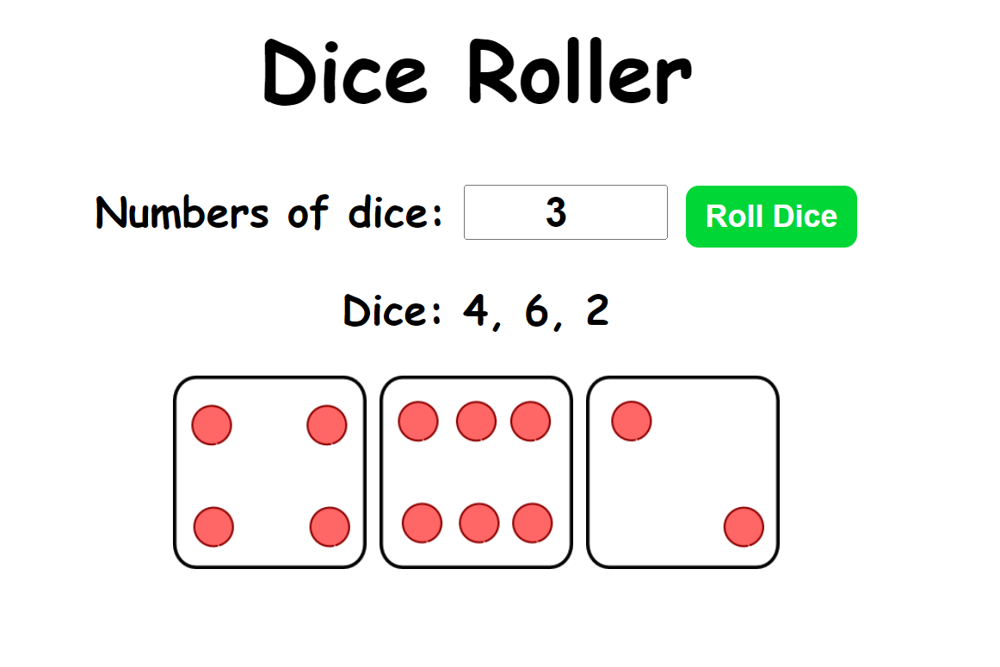

# diceRoller

This simple web application allows users to roll a specified number of dice and view the results both numerically and visually. The application consists of three main files: index.html, index.js, and styles.css.

## How to Use

1. Open the index.html file in a web browser.
2. Enter the desired number of dice in the input field.
3. Click the "Roll Dice" button.
4. View the numeric results and corresponding dice images.

## Enjoy rolling the dice! 🎲

## App

